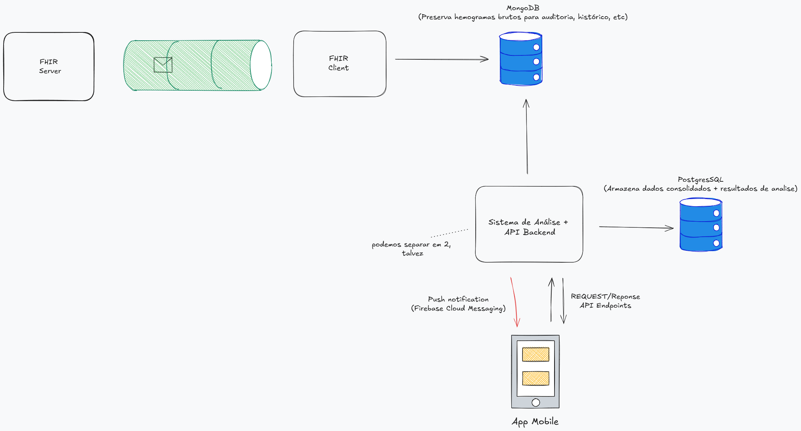

# Software para Computação Ubíqua — 2025.02

#### Versão: 3.0

#### Professor:

- Fabio Nogueira de Lucena

#### Alunos:

- João Gabriel Cavalcante França
- José Carlos Lee
- Leonardo Moreira Araújo
- Luis Felipe Ferreira Silva
- Matheus Franco Cascão Costa

#### Resumo:

Sistema integrado (Backend + Android) para monitoramento em tempo real de condições clínicas a partir de hemogramas (FHIR), com detecção individual de Anemia Severa e análise coletiva de surtos de parasitose. O backend processa Bundles FHIR, popula uma base analítica, executa os algoritmos e dispara notificações push. O app Android consome os alertas e apresenta as informações.

- Arquitetura (alto nível):  
  

- Fluxo de Dados:  
  

- Diagrama de Componentes:  
  

- Repositório: `software-ubiquo/server` (Backend Node/TS) e `software-ubiquo/android-app` (Android).

## Stack Tecnológico

O projeto foi construído utilizando tecnologias modernas e robustas para garantir escalabilidade e facilidade de manutenção:

- **Backend:**

  - **Linguagem:** TypeScript (Node.js)
  - **Framework:** Express.js
  - **ORM:** Drizzle ORM
  - **Banco de Dados:** PostgreSQL
  - **Integração:** HAPI FHIR (via Webhooks)
  - **Notificações:** Firebase Cloud Messaging (FCM)

- **Mobile (Android):**

  - **Linguagem:** Kotlin
  - **UI Toolkit:** Jetpack Compose (provável, verificar código) ou XML Views
  - **Comunicação:** Retrofit (HTTP)

- **DevOps & Infraestrutura:**
  - **Containerização:** Docker & Docker Compose
  - **Scripts:** Shell Script (para população de dados)

## Estrutura do Projeto

A organização do repositório reflete a separação de responsabilidades entre o servidor de processamento e o cliente móvel:

```
software-ubiquo/
├── android-app/          # Código fonte do aplicativo Android
│   ├── app/              # Módulo principal do app
│   └── ...
├── server/               # Backend Node.js/TypeScript
│   ├── src/
│   │   ├── algorithms/   # Lógica de detecção (Anemia, Parasitose)
│   │   ├── database/     # Schemas do Drizzle e conexão DB
│   │   ├── services/     # Serviços (FHIR, Notificações, etc.)
│   │   ├── types/        # Definições de tipos TypeScript
│   │   ├── api.ts        # Definição das rotas da API
│   │   └── index.ts      # Ponto de entrada do servidor
│   ├── DOCKER.md         # Guia específico para Docker
│   ├── SETUP.md          # Guia de configuração manual
│   └── ...
└── diagramas/            # Artefatos visuais da documentação
```

## Objetivo e Raciocínio do Projeto

O objetivo central deste trabalho não é apenas processar dados médicos, mas demonstrar como a **Computação Ubíqua** pode atuar em duas frentes distintas e complementares na saúde pública: a **intervenção individual imediata** e a **vigilância epidemiológica coletiva**.

### Por que escolhemos Anemia Severa e Parasitose?

A escolha dessas duas patologias foi intencional para ilustrar dois paradigmas de processamento:

1.  **Anemia Severa (O Indivíduo / Tempo Real):**

    - **O Problema:** Uma condição crítica que coloca a vida do paciente em risco imediato. Não depende de contexto geográfico ou histórico, apenas do valor atual da hemoglobina.
    - **A Solução:** Processamento _stream_ (tempo real). Assim que o dado chega, ele é analisado. Se for crítico, o médico é avisado no mesmo instante.
    - **Raciocínio:** Demonstra a capacidade do sistema de reagir a eventos urgentes ("Push Notification" para ação rápida).

2.  **Surtos de Parasitose (O Coletivo / Análise Espacial):**
    - **O Problema:** Um caso isolado de eosinofilia (aumento de eosinófilos) pode não significar muito (pode ser alergia, medicamento, etc.). Porém, **vários casos** em uma mesma vizinhança, ao mesmo tempo, sugerem um fator ambiental (água contaminada, solo infectado).
    - **A Solução:** Processamento _batch_ (agendado) e espacial. O sistema "olha para trás" (janela de 30 dias) e "olha ao redor" (geolocalização) para encontrar padrões que não são visíveis individualmente.
    - **Raciocínio:** Demonstra a capacidade do sistema de transformar dados brutos individuais em inteligência de saúde pública (detecção de surtos).

## Decisões de Design e Arquitetura

Para suportar essas análises, tomamos algumas decisões arquiteturais importantes:

### 1. Quilometragem e Vizinhança (O "Epsilon" do DBSCAN)

Para detectar surtos, não basta contar casos por cidade. Um surto pode ser localizado em um bairro específico.

- **Decisão:** Utilizamos o algoritmo de clusterização **DBSCAN** com um raio (`epsilon`) de aproximadamente **2km**.
- **Por que?** Isso define o que consideramos "vizinhança". Se 5 ou mais casos de eosinofilia ocorrem dentro desse raio de 2km, o algoritmo os agrupa como um potencial foco de infecção. Isso permite detectar surtos locais que seriam invisíveis se olhássemos apenas para estatísticas estaduais ou municipais.

### 2. O Papel do Município (Validação Estatística)

Embora o cluster seja detectado por coordenadas (lat/long), precisamos saber se aquele aglomerado é _realmente_ anômalo.

- **Decisão:** Usamos o **Município** como unidade administrativa para buscar a "linha de base" (baseline).
- **Por que?** Dados de saúde pública são geralmente agregados por município. Ao identificar um cluster, verificamos a qual município ele pertence para comparar a taxa de incidência observada no cluster com a taxa histórica _daquele município_.

### 3. A Comparação (Taxa Observada vs. Esperada)

Como saber se um cluster é um surto ou apenas coincidência?

- **Decisão:** Implementamos um teste estatístico simplificado (Z-score).
- **Lógica:**
  - Calculamos a **Taxa Observada** no cluster (Casos / Total de Exames na área).
  - Comparamos com a **Taxa Esperada** (Média Histórica do Município + 2 Desvios Padrão).
  - Se a Taxa Observada for maior que esse limite, o sistema emite um **Alerta de Surto**.
- **Por que?** Isso reduz falsos positivos. Só alertamos o gestor se a concentração de casos for estatisticamente significativa para aquela região e época do ano.

## Visão Geral dos Algoritmos

O sistema possui dois algoritmos centrais:

- Análise Individual em Tempo Real: detecção de Anemia Severa em um único paciente.
- Análise Coletiva Agendada: detecção de clusters (surtos) de Parasitose por eosinofilia.

Ambos dependem de uma base analítica otimizada, evitando duplicação de dados brutos e focando em registros necessários à análise espacial/temporal e estatística.

## Base Analítica (Arquitetura de Dados)

A base analítica é populada pelo serviço principal à medida que os hemogramas FHIR são parseados. No código, as tabelas são definidas via Drizzle ORM em `server/src/database/schema.ts`. Abaixo, os conceitos e seus mapeamentos reais:

- Tabela: `casos_eosinofilia` → real: `eosinophilia_cases`

  - Propósito: um registro por hemograma que atende ao critério clínico de eosinofilia. Fonte para análise espacial de surtos.
  - Populada: em tempo real, a cada hemograma processado.
  - Colunas (conceito → real):
    - `id` → `id`
    - `data_exame (DATETIME)` → `exam_date`
    - `valor_eosinofilos (INTEGER/FLOAT)` → `eosinophils_value` (valor normalizado; ver `unit-converter.ts`)
    - `idade (INTEGER)` → `age`
    - `sexo (VARCHAR)` → `sex`
    - `latitude (FLOAT)` → `latitude`
    - `longitude (FLOAT)` → `longitude`
    - `municipio_id (VARCHAR)` → `municipality_id` (código IBGE)

- Tabela: `exames_geolocalizados` → real: `geolocated_tests`

  - Propósito: localização de todos os hemogramas recebidos (denominador para cálculo de taxas e comparação justa).
  - Populada: em tempo real, a cada hemograma processado.
  - Colunas (conceito → real):
    - `id` → `id`
    - `data_exame (DATETIME)` → `exam_date`
    - `latitude (FLOAT)` → `latitude`
    - `longitude (FLOAT)` → `longitude`
    - `municipio_id (VARCHAR)` → `municipality_id`

- Tabela: `baseline_regional` → real: `regional_baselines`
  - Propósito: valores de referência históricos ("normalidade" estatística) por região. Base para validação de surtos.
  - Populada: via script de seeding na implantação (ver `server/SETUP.md`).
  - Colunas (conceito → real):
    - `regiao_id (VARCHAR)` → `region_id` (geralmente código IBGE do município)
    - `mes_ano (VARCHAR, ex: "2025-09")` → `month_year` (formato `YYYY-MM`)
    - `taxa_esperada_por_1000_exames (FLOAT)` → `expected_rate_per_1000`
    - `desvio_padrao_da_taxa (FLOAT)` → `std_dev_of_rate`

Observações:

- A normalização do valor de eosinófilos é feita no parser (`fhir-parser.ts`) e utilitário (`unit-converter.ts`), assegurando consistência de unidades.
- A geolocalização usa endereço + extensões FHIR (lat/long). Para mapas precisos, recomenda-se evoluir para PostGIS quando necessário.

## Algoritmo 1: Análise Individual — Anemia Severa (Tempo Real)

- Função (real): `analyzeSevereAnemia(bloodwork)` em `server/src/algorithms/individual-analysis.ts`.
- Objetivo: identificar anemia severa em um único paciente e disparar alerta imediato.
- Disparo: a cada hemograma processado (ex.: via fluxo FHIR).
- Entrada: `bloodwork` (JSON do hemograma parseado; ver tipos em `server/src/types/bloodwork.ts`).
- Lógica:
  - Verifica condição principal: `bloodwork.hemoglobin.value < 8.0`.
  - Se verdadeiro:
    - Cria objeto de alerta enriquecido com dados contextuais (VCM/MCV, Hematócrito, CPF, etc.).
    - Dispara notificação push (ver `notification-service.ts`; requer token FCM válido).
    - Retorna `AlertIndividual`.
  - Se falso: nenhuma ação; retorna `null`.
- Saída: `AlertIndividual` ou `null`.

Notas:

- O token FCM está como placeholder no código; configure-o via `.env`/secrets e fluxo do Android.
- Avaliações complementares podem ser adicionadas (ex.: idade/sexo) se houver requisitos clínicos extra.

## Algoritmo 2: Análise Coletiva — Surto de Parasitose (Agendada)

- Função (real): `analyzeParasitosisOutbreak()` em `server/src/algorithms/collective-analysis.ts`.
- Objetivo: identificar clusters geográficos de eosinofilia estatisticamente anormais em relação à baseline histórica.
- Disparo: agendado (ex.: Cron diário na madrugada; ver seção Agendamento).
- Entrada: nenhuma (função consulta o banco).

### Processo Lógico

1. Janela Temporal

- Define período: `data_fim = agora`, `data_inicio = agora - 30 dias`.

2. Coleta de Casos

- Query em `eosinophilia_cases` para registros na janela:
  - Seleciona `latitude`, `longitude`, `age`, `sex`, `exam_date`.

3. Análise Espacial (DBSCAN)

- Aplica DBSCAN sobre coordenadas dos casos positivos.
- Parâmetros (ajustáveis conforme densidade/região):
  - `epsilon (ε)`: raio máximo para agrupar pontos (ex.: `2000` metros).
  - `minPts`: mínimo de casos para formar cluster (ex.: `5`).
- Resultado: lista de clusters (grupos de casos geograficamente próximos).

4. Validação Estatística por Cluster

- Para cada `cluster`:
  a) Mapeamento Geográfico

  - Calcula centroide do cluster.
  - Determina `municipality_id` do centroide (ver util `findMunicipalityByCoordinates` em `db.ts`).

  b) Taxa Observada (micro)

  - `n_casos_cluster = cluster.length`.
  - `total_exames_area`: COUNT em `geolocated_tests` na área do cluster (lat/long + raio `epsilon`) e janela temporal.
  - `taxa_observada = (n_casos_cluster / total_exames_area) * 1000`.

  c) Baseline (macro)

  - Consulta `regional_baselines` por `municipality_id` + `month_year` atual.
  - Obtém `expected_rate_per_1000` e `std_dev_of_rate`.

  d) Critério de Surto

  - `limite_surto = expected_rate_per_1000 + (2 * std_dev_of_rate)`.
  - Surto confirmado se `taxa_observada > limite_surto`.

  e) Alerta Coletivo

  - (Opcional) `filtrarCausasNaoInfecciosas(cluster)` para reduzir falsos positivos.
  - Constrói `AlertCollective` com: localização, número de casos, taxa observada vs. esperada, perfil demográfico (idade, sexo).
  - Dispara push notification para perfis responsáveis (FCM).

### Considerações Técnicas

- Geoespacial: `db.ts` usa Haversine simplificado; para produção/alta precisão, evoluir para PostGIS e índices geoespaciais.
- Baseline: deve ser semeada (`seed.ts`) e mantida alinhada ao calendário (`month_year`).
- Performance: ajuste `epsilon`/`minPts` por densidade urbana/rural; clusters muito grandes podem indicar nova parametrização.

## Agendamento

- Backend Node/TS não executa Cron nativamente em produção; recomenda-se:
  - `node-cron` no serviço (simples, dev/prototipação), ou
  - Agendador externo (ex.: `cron` no host, Kubernetes CronJob, ou serviço de agendamento da infraestrutura).
- Tarefa: executar `analyzeParasitosisOutbreak()` diariamente.

## Setup e Instalação

Para rodar o projeto localmente, você tem duas opções principais: via Docker (recomendado) ou Manualmente.

### Opção 1: Docker (Recomendado)

A maneira mais fácil de subir o ambiente completo (Banco + Backend) é usando o Docker Compose.

1.  **Pré-requisitos:** Docker e Docker Compose instalados.
2.  **Configuração:**
    - Navegue até `software-ubiquo/server`.
    - Crie o arquivo `.env` baseado no `.env.example`.
3.  **Execução:**
    ```bash
    docker compose up -d
    ```
    Isso subirá o PostgreSQL e a API Node.js automaticamente.
4.  **Detalhes:** Consulte o arquivo `software-ubiquo/server/DOCKER.md` para comandos avançados e troubleshooting.

### Opção 2: Manual (Node.js + PostgreSQL Local)

1.  **Pré-requisitos:** Node.js 18+, pnpm (ou npm), PostgreSQL 15+ rodando.
2.  **Instalação:**
    ```bash
    cd software-ubiquo/server
    pnpm install
    ```
3.  **Banco de Dados:**
    - Crie um banco de dados no seu Postgres local.
    - Configure as credenciais no `.env`.
    - Rode as migrações e o seed:
      ```bash
      pnpm db:migrate
      pnpm db:seed
      ```
4.  **Rodar:**
    ```bash
    pnpm dev
    ```
    O servidor estará disponível em `http://localhost:3000`.

Para mais detalhes sobre o setup manual, consulte `software-ubiquo/server/SETUP.md`.

## Android — Pontos-chave

- Configure FCM no app; injete `BASE_URL` apontando para o backend (`10.0.2.2` no emulador).
- Libere tráfego HTTP local via `network_security_config` quando necessário.

## Fluxo de Dados (resumo)

1. FHIR Bundle recebido (HAPI/servidor FHIR) → webhook backend.
2. Parse (`fhir-parser.ts`) + normalização de unidades.
3. Popula `eosinophilia_cases` e `geolocated_tests`.
4. Executa `analyzeSevereAnemia` em tempo real; envia alerta individual.
5. Agendado: `analyzeParasitosisOutbreak`; valida clusters com baseline; envia alerta coletivo.

## Funcionamento

- Escopo: servidor de back-end que analisa hemogramas para detectar riscos individuais (anemia severa) e coletivos (surtos de parasitose).

- Funcionalidades principais:
- Análise de dados de saúde:
  - Individual: `server/src/algorithms/individual-analysis.ts` detecta anemia severa por hemoglobina.
  - Coletiva: `server/src/algorithms/collective-analysis.ts` identifica surtos via casos de eosinofilia, DBSCAN e comparação com baseline histórica.
- Integração com FHIR:
  - Recebe webhooks, busca Bundles (`server/src/services/fhir-service.ts`), extrai dados (`server/src/services/fhir-parser.ts`) e normaliza unidades (`server/src/services/unit-converter.ts`).
- Banco de dados:
  - PostgreSQL + Drizzle (`server/src/database/schema.ts`, `server/src/database/db.ts`) com tabelas para casos de eosinofilia, exames geolocalizados, baselines, cidades e estados.
- Notificações:
  - Envia push via Firebase Cloud Messaging (`server/src/services/notification-service.ts`) para médicos e gestores.
- API:

  - Express (`server/src/api.ts`) com endpoints:
    - `PUT /fhir-webhook/Bundle/:id`
    - `GET /alert/:id`
    - Endpoints de teste para análises manuais.

- Resumo do fluxo de trabalho:
  - Servidor FHIR aciona webhook quando há novos dados.
  - Backend busca o Bundle FHIR.
  - Parser extrai e normaliza dados (paciente, exames, localização).
  - Dados persistidos no PostgreSQL.
  - Algoritmos executam análises sobre os novos dados.
  - Se há risco: gera alerta.
  - Notificação push enviada ao profissional responsável.

## Mapeamento de Conceitos

- Caso de eosinofilia → Tabela `eosinophilia_cases`
  - Colunas: `id`, `test_date`, `eosinophils_value`, `age`, `sex`, `latitude`, `longitude`, `municipality_id`
  - Origem FHIR típica: `Observation` (eosinófilos), `Patient` (sexo/idade), geocoordenadas via `Location`/endereço ou GPS; município via `city.codigo_ibge`.
- Exame geolocalizado → Tabela `geolocated_tests`
  - Colunas: `id`, `test_date`, `latitude`, `longitude`, `municipality_id`
  - Origem FHIR típica: `Observation.effectiveDateTime` → `test_date`; `Location`/endereço → coordenadas; município via `city.codigo_ibge`.
- Baseline regional → Tabela `regional_baselines`
  - Colunas: `id`, `region_id` (IBGE), `month_year` ("YYYY-MM"), `expected_rate_per_1000_tests`, `rate_standard_deviation`
  - Uso: comparação estatística por município e mês no surto de parasitose.
- Município → Tabela `city`
  - Colunas: `codigo_ibge`, `nome`, `latitude`, `longitude`, `capital`, `codigo_uf`, `siafi_id`, `ddd`, `fuso_horario`
  - Uso: `codigo_ibge` é a chave usada como `municipality_id`/`region_id` nas análises.
- Estado → Tabela `estados`
  - Colunas: `codigo_uf`, `uf`, `nome`, `latitude`, `longitude`, `regiao`

## API Rápida

- `GET /alert/:id` — obter detalhes mock do alerta.
  ```bash
  curl http://localhost:3000/alert/abc123
  ```
- `GET /test-anemia-alert` — aciona análise individual com caso mock.
  ```bash
  curl http://localhost:3000/test-anemia-alert
  ```
- `GET /test-parasitosis-outbreak` — roda análise coletiva sobre dados existentes.
  ```bash
  curl http://localhost:3000/test-parasitosis-outbreak
  ```
- `PUT /fhir-webhook/Bundle/:id` — processa Bundle FHIR pelo ID (busca no servidor FHIR).
  1. Publique um Bundle no HAPI FHIR:
  ```bash
  curl -X POST \
    -H "Content-Type: application/fhir+json" \
    -d @software-ubiquo/server/exemplos-hemogramas/sample-eosinophilia-bundle.json \
    http://localhost:8080/fhir/Bundle
  ```
  2. Copie o `id` do Bundle retornado e acione o webhook:
  ```bash
  curl -X PUT http://localhost:3000/fhir-webhook/Bundle/<ID>
  ```

## Exemplos de Alertas

- Alerta Individual (JSON):
  ```json
  {
    "type": "SEVERE_ANEMIA",
    "patient_cpf": "111.222.333-44",
    "alert_date": "2025-10-17T03:00:00.000Z",
    "details": {
      "hemoglobin": 7.5,
      "hematocrit": 25,
      "mcv": 82
    }
  }
  ```
- Alerta Coletivo (JSON):
  ```json
  {
    "id": "outbreak-5208707-1730000000000",
    "type": "PARASITOSIS_OUTBREAK",
    "alert_date": "2025-10-17T03:00:00.000Z",
    "location": {
      "centroid_lat": -16.68,
      "centroid_lon": -49.25,
      "radius_meters": 2000,
      "municipality_id": "5208707"
    },
    "statistics": {
      "case_count": 7,
      "observed_rate_per_1000": 35,
      "expected_rate_per_1000": 5,
      "outbreak_threshold_per_1000": 8
    },
    "cluster_info": {
      "average_age": 29.4,
      "sex_distribution": { "M": 3, "F": 4 }
    },
    "case_ids": ["case_1", "case_2", "case_3"]
  }
  ```

## Subscription FHIR

- Objetivo: acionar o backend automaticamente ao criar um Bundle.
- HAPI FHIR (R4) usa `Subscription` do tipo `rest-hook` para enviar o recurso ao endpoint.
- Nota: alguns servidores não suportam caminho com ID no endpoint do `rest-hook`. Se for o caso, use uma rota que aceite `POST` com o Bundle completo, ou mantenha o fluxo manual acima.
- Exemplo de `Subscription` (ajuste conforme seu HAPI):
  ```json
  {
    "resourceType": "Subscription",
    "status": "active",
    "criteria": "Bundle",
    "reason": "Notificar backend em novos Bundles",
    "channel": {
      "type": "rest-hook",
      "endpoint": "http://localhost:3000/fhir-webhook/Bundle/{id}",
      "payload": "application/fhir+json"
    }
  }
  ```

## Parâmetros e Ajustes

- DBSCAN: `epsilon ≈ 2km`, `minPts = 5` (ajuste pela densidade urbana/rural).
- Baseline: manter `regional_baselines` povoada e alinhada ao `month_year (YYYY-MM)` atual.
- Tokens FCM: trocar placeholders por tokens reais (médicos/gestores) e documentar como são obtidos/mapeados.

## Limitações

- Geoespacial simplificado: bounding-box com Haversine; para produção, prefira PostGIS + índices.
- Unidades: o parser normaliza eosinófilos, mas dados heterogêneos podem exigir ajustes.
- Localização ausente: sem lat/long, casos não entram em análises espaciais; registre esse fato.
- Placeholders: tokens FCM e município default podem existir em desenvolvimento; substitua em produção.

## Testes

- Testes de algoritmos: `software-ubiquo/server/src/algorithms/__tests__/`.
- Rodar testes:
  ```bash
  cd software-ubiquo/server
  pnpm test
  ```

## Troubleshooting

- Conexão DB: ver `server/src/database/connection.ts` e `.env`.
- Token FCM: placeholder → substituir por token real do médico/dispositivo.
- Geolocalização faltante no FHIR: sem coordenadas, casos não entram em análises espaciais.

## Possíveis Melhorias Futuras (Roadmap)

Para evoluir o sistema e torná-lo um produto de mercado, sugerimos os seguintes passos:

1.  **Geoespacial Avançado:** Migrar para **PostGIS** para permitir queries espaciais mais complexas e performáticas (ex: polígonos de bairros reais em vez de raio simples).
2.  **Dashboard Web:** Criar um painel administrativo (React/Next.js) para gestores de saúde visualizarem os mapas de calor e gerenciarem alertas.
3.  **Segurança:** Implementar autenticação robusta (OAuth2/OpenID Connect) para proteger a API e os dados sensíveis dos pacientes.
4.  **Machine Learning:** Treinar modelos preditivos com os dados históricos para antecipar surtos antes mesmo da regra estatística ser ativada.

## Créditos

Projeto acadêmico (UFG – Computação Ubíqua).